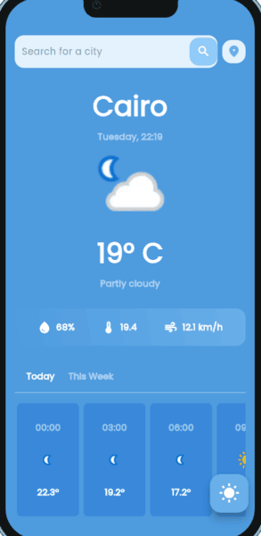
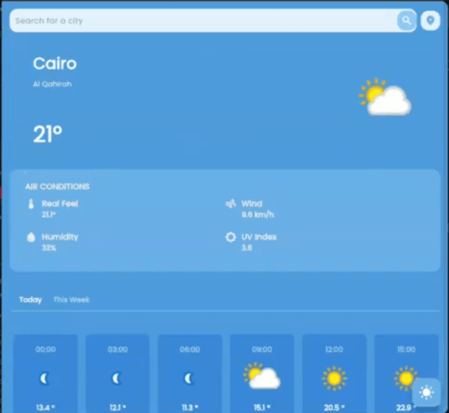
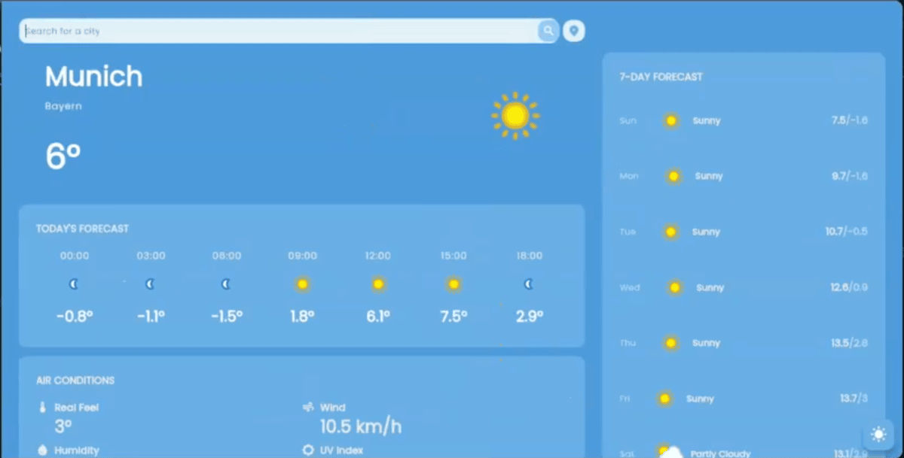
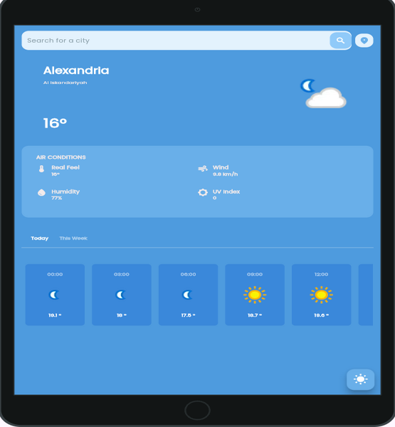

# WeatherMate - Flutter Weather Application 🌦️✨


## 🌤️ App Showcase

### 🎮 Video Demonstration
[🎥 Watch App Demo](https://drive.google.com/file/d/1IJeqzc8P6qShVCna4zXeXUcYk5RjiyP5/view?usp=sharing)

### 📱 Screenshots
<p align="center">
  
  
  
  
  
  
</p>

## 🚀 Project Overview

WeatherMate is a Flutter-based application that provides users with real-time weather information based on their current location or a custom search query. The app fetches data from **WeatherAPI** and displays detailed weather forecasts, including current weather, hourly forecasts, and 7-day forecasts. Users can also get AI-powered weather predictions and enjoy a seamless user experience.

### 🔑 Key Highlights
- 🌍 **Real-Time Weather Data**: Fetches live weather data from **WeatherAPI**.
- 📍 **Location-Based Forecasts**: Automatically detects the user's location for accurate weather updates.
- 🔍 **Search Functionality**: Allows users to search for weather information by city name.
- 📅 **7-Day Forecast**: Displays detailed weather forecasts for the upcoming week.
- 🤖 **AI-Powered Predictions**: Provides weather predictions using a machine learning model.
- 🛠️ **Modern UI**: Clean and responsive user interface for a smooth experience.
- 💡 **Clean Architecture & Code**: Follows best practices for maintainability and scalability.

## 🛋️ Technical Specifications

| Aspect | Details |
|--------|---------|
| **Framework** | Flutter |
| **State Management** | Cubit |
| **Architecture** | Clean Architecture |
| **API Handling** | Dio |
| **Weather Data Source** | [WeatherAPI](https://www.weatherapi.com/) |
| **Dependency Injection** | GetIt |
| **Animations** | Lottie |
| **Caching** | Cached Network Image |

## ✨ Features

- 🌍 **Real-Time Weather Data**
- 📍 **Location-Based Forecasts**
- 🔍 **Search Functionality**
- 📅 **7-Day Forecast**
- 🤖 **AI-Powered Predictions**
- 🌐 **Beautiful & Intuitive User Interface**
- 🔄 **Real-Time Data Updates**

## 🛠️ Getting Started

### Prerequisites
- Flutter SDK
- Dart SDK
- Android Studio or VS Code

### Installation
1. Clone the repository
```bash
git clone https://github.com/Maheresio/WeatherMate.git
```

2. Install dependencies
```bash
flutter pub get
```

3. Run the app
```bash
flutter run
```

## 🤝 Technology Stack & Dependencies
- **Flutter**
- **Dart**
- **Cubit (State Management)**
- **Dio (API Handling)**
- **GetIt (Dependency Injection)**
- **Lottie (Animations)**
- **Cached Network Image (Image Caching)**
- **Shimmer (Loading Effects)**
- **Google Fonts (Custom Fonts)**
- **Carousel Slider (Image Carousel)**

## 🤝 About the Developer
This project was developed by Ahmed Maher, a passionate Flutter developer focusing on building scalable and user-friendly mobile applications. WeatherMate demonstrates skills in:
- API integration
- Clean Architecture 
- State Management with Cubit
- Clean Code & Best Practices
- UI/UX Optimization

## 🎨 Design Inspiration
- UI/UX Design: Custom-built with modern and minimal aesthetics.

## 💪 Acknowledgments
- Flutter Team
- Dio Package Maintainers
- [WeatherAPI](https://www.weatherapi.com/)
- Lottie for Animations
- Contributors & Open-Source Community

## 🙏 Contributing
Contributions, issues, and feature requests are welcome! Feel free to check the [issues page](https://github.com/Maheresio/weather-mate/issues).

---
